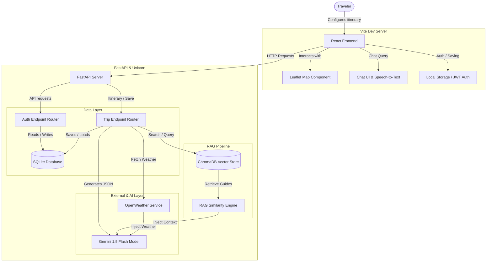

# TripPlanner AI System Architecture

This document describes the flow and architecture of the **TripPlanner AI** application.

---

## Component Walkthrough

### 1. React Frontend (Client)
- **Vite React**: React 19 app utilizing components for rendering modular cards (Weather, Hotels, Attractions, Itinerary).
- **Tailwind CSS**: A unified design system using custom brand colors (Blue `#2563EB` and Emerald `#10B981`) and dark mode toggles.
- **Leaflet Map**: Generates interactive mapping pins for restaurants, hotels, and attractions without restricted Google Maps API keys.
- **Web Speech API**: Uses browser Speech-to-Text API dictation to capture microphone inputs for user interests.

### 2. FastAPI Backend
- **FastAPI Router**: Coordinates endpoints `/plan-trip`, `/chat`, `/weather`, `/places`, and `/save-trip`.
- **SQLAlchemy ORM**: Tracks user accounts and saved trips using SQLite for local development and supporting PostgreSQL.
- **JWT Cryptography**: Secures endpoints with standard OAuth2 password bearer tokens.

### 3. Retrieval-Augmented Generation (RAG)
- **ChromaDB**: SQLite/filesystem-based document store indexing travel guides loaded from `backend/app/rag/data/` (Paris, Tokyo, Rome, New York).
- **Keyword Fallback**: Prevents execution failures on environments missing C++ dependencies or API configurations by providing fallback term-matching algorithms.
- **Google Gemini 1.5 Flash**: Orchestrates JSON generation under system instructions to ensure consistent schema responses.
- **Weather Simulation**: Gracefully simulates forecast data when no OpenWeather keys are specified, guaranteeing consistent UX.
